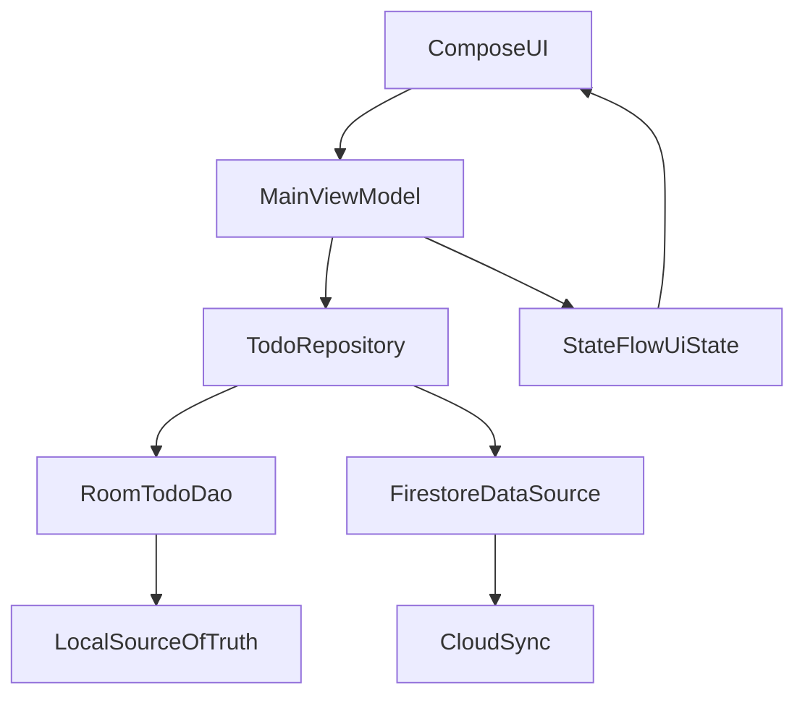

# Todo MVVM + Room + Firestore Plan

## Current Gaps Found

- `MainActivity` is fetching todos directly on startup with `mainViewModel.getAllTodos()` before Compose state handling, which will block once Room is used: `[app/src/main/java/com/slu/tododemo/MainActivity.kt](app/src/main/java/com/slu/tododemo/MainActivity.kt)`.
- `TodoRepository` still returns mock list and Room calls are commented out: `[app/src/main/java/com/slu/tododemo/data/TodoRepository.kt](app/src/main/java/com/slu/tododemo/data/TodoRepository.kt)`.
- DAO methods are not `suspend` / `Flow`, so they are not coroutine-friendly yet: `[app/src/main/java/com/slu/tododemo/data/TodoDao.kt](app/src/main/java/com/slu/tododemo/data/TodoDao.kt)`.
- UI action buttons are fixed `48.dp` with zero content padding, making them look cramped: `[app/src/main/java/com/slu/tododemo/TodoItemComposable.kt](app/src/main/java/com/slu/tododemo/TodoItemComposable.kt)`.

## Architecture Target

## Implementation Steps

### 1) Make Room API coroutine-first

- Update DAO in `[app/src/main/java/com/slu/tododemo/data/TodoDao.kt](app/src/main/java/com/slu/tododemo/data/TodoDao.kt)`:
  - Use `Flow<List<TodoEntity>>` for `getAllTodos()`.
  - Mark write/read-by-id operations as `suspend`.
  - Keep `upsert` for simple create/update path.
- Keep `AppDatabase` as provider and ensure repository builds DB once.

### 2) Refactor repository to real data source + mappers

- Replace mock list logic in `[app/src/main/java/com/slu/tododemo/data/TodoRepository.kt](app/src/main/java/com/slu/tododemo/data/TodoRepository.kt)` with Room DAO calls.
- Expose:
  - `observeTodos(): Flow<List<TodoItem>>`
  - `addTodo(todo: TodoItem)`
  - `updateTodo(todo: TodoItem)`
  - `deleteTodo(todo: TodoItem)`
- Add entity <-> UI mapping helpers in repository (or separate mapper file) so ViewModel stays thin.

### 3) Load todos on app start from ViewModel with coroutines

- In `[app/src/main/java/com/slu/tododemo/presentation/MainViewModel.kt](app/src/main/java/com/slu/tododemo/presentation/MainViewModel.kt)`:
  - Introduce `MutableStateFlow<List<TodoItem>>` or `MutableStateFlow<UiState>`.
  - In `init {}`, collect repository `Flow` using `viewModelScope.launch`.
  - Expose immutable state to UI.
  - Add `onAddTodo`, `onUpdateTodo`, `onDeleteTodo` methods that call repository inside `viewModelScope.launch`.

### 4) Rework Compose screen structure + add FAB

- In `[app/src/main/java/com/slu/tododemo/MainActivity.kt](app/src/main/java/com/slu/tododemo/MainActivity.kt)`:
  - Do not call `getAllTodos()` directly in activity.
  - Collect ViewModel state in Compose via `collectAsState()`.
  - Add `Scaffold(floatingActionButton = { FloatingActionButton(...) })` to create new todo.
- In `[app/src/main/java/com/slu/tododemo/TodoItemComposable.kt](app/src/main/java/com/slu/tododemo/TodoItemComposable.kt)`:
  - Replace tight row with Material3 `Card` + spacing and typography.
  - Use `IconButton` for edit/complete actions (clearer intent than small full buttons).
  - Add `Spacer(Modifier.weight(1f))` to align actions right.
  - Apply consistent paddings (`12-16.dp`) and min touch sizes.

### 5) CRUD call pattern (what to call from UI)

- Create: FAB tap -> show input (dialog/sheet) -> `viewModel.onAddTodo(...)`.
- Read: UI observes `todosState` only (no direct repository/DAO from UI).
- Update: edit icon tap -> edit form -> `viewModel.onUpdateTodo(...)`.
- Delete/Complete: action icon tap -> `viewModel.onDeleteTodo(...)` or status-update method.

### 6) Add Firestore for cloud push/sync sample

- Add Firebase setup and dependencies in Gradle files:
  - Root plugin alias + app plugin for Google services in `[build.gradle.kts](build.gradle.kts)` and `[app/build.gradle.kts](app/build.gradle.kts)`.
  - Firestore KTX dependency in app module.
- Add `google-services.json` to app module.
- Implement a lightweight Firestore data source class (new file under `data/`) with sample methods:
  - `pushTodo(todo)`
  - `deleteTodo(id)`
  - `observeTodos()` (optional learning step)
- Start with one-way sync (Room -> Firestore on create/update/delete), then optionally add Firestore -> Room reconciliation.

## Teaching-Friendly Code Samples To Provide During Implementation

- `suspend` DAO + `Flow` read sample.
- ViewModel `init` + `viewModelScope.launch` collection sample.
- Compose `Scaffold` + `FloatingActionButton` + `collectAsState` sample.
- Firestore `set`, `update`, `delete`, and listener (`addSnapshotListener`) sample.

## Validation Plan

- Launch app and verify todos render from Room automatically.
- Add/update/delete todo and verify list updates without manual refresh.
- Verify FAB is visible and opens create flow.
- Verify Firestore document appears/updates/deletes for each CRUD action.
- Rotate screen to confirm state survives via ViewModel + DB.

